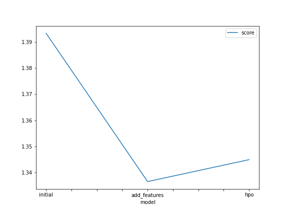

# Report: Predict Bike Sharing Demand with AutoGluon Solution
#### Peter Ndumba

## Initial Training
### What did you realize when you tried to submit your predictions? What changes were needed to the output of the predictor to submit your results?
TODO:Needed to parse the date and set the predictions to zero values

### What was the top ranked model that performed?
TODO: WeightedEsemble_L3 is the model did well

## Exploratory data analysis and feature creation
### What did the exploratory analysis find and how did you add additional features?
TODO: I have created new features in which I created hour,day,and month from datetime variable
Also I have change the weather column to category data type

### How much better did your model preform after adding additional features and why do you think that is?
TODO: The model perfomed abit poorly this is because increasing more features doesnot really bring much impact but can results in overfiting

## Hyper parameter tuning
### How much better did your model preform after trying different hyper parameters?
TODO: The model perfomed much better compared to both initial and added features model

### If you were given more time with this dataset, where do you think you would spend more time?
TODO: I would have spend most of my time on trying different algorithms to meausere the perfomance
Also will will try use hyperparameters tuning to improve the perfomance of the model.
Perfom feature engineering on some column to increas the effectiveness

### Create a table with the models you ran, the hyperparameters modified, and the kaggle score.
|model|hpo1|hpo2|hpo3|score|
|--|--|--|--|--|
|initial|?|?|?|?|
|add_features|?|?|?|?|
|hpo|?|?|?|?|

### Create a line plot showing the top model score for the three (or more) training runs during the project.

TODO: Replace the image below with your own.

### Create a line plot showing the top kaggle score for the three (or more) prediction submissions during the project.

TODO: Replace the image below with your own.

## Summary
TODO: Add your explanation
First,I familiarise myself with data in which I did data explonaroy using the .head() and .describe() functions
It was found that the data is already prepared so it was not neccesaary to perfom train_test_spling and however 
featuring engineering was incorparted on datetime to increase the on the model.
Autogluon was used to train on train dataset and the model best to train different model and top model was
From that new features were created and rerun the model and hyperparameters were used and the model was again rerun.
The model training concluded that using different hyperparameters can increase model perfomance compared model trained on orignial and newly created features
